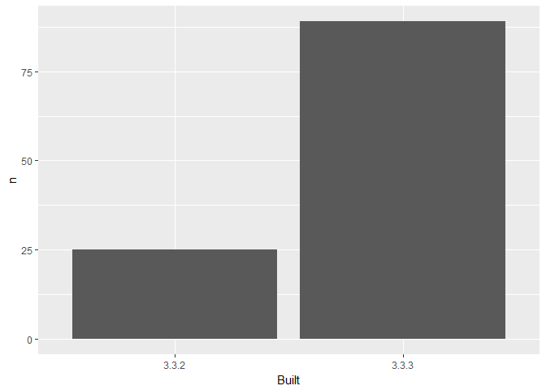

03\_barchart-packages-built.R
================
BRIANMERK
Thu Oct 04 14:38:25 2018

``` r
## remember to restart R here!

library(tidyverse)
```

    ## Warning: package 'tidyverse' was built under R version 3.3.3

    ## -- Attaching packages ----------------------------------------------- tidyverse 1.2.1 --

    ## v ggplot2 2.2.1     v purrr   0.2.4
    ## v tibble  1.3.4     v dplyr   0.7.4
    ## v tidyr   0.7.2     v stringr 1.2.0
    ## v readr   1.1.1     v forcats 0.2.0

    ## Warning: package 'tibble' was built under R version 3.3.3

    ## Warning: package 'tidyr' was built under R version 3.3.3

    ## Warning: package 'readr' was built under R version 3.3.3

    ## Warning: package 'purrr' was built under R version 3.3.3

    ## Warning: package 'dplyr' was built under R version 3.3.3

    ## -- Conflicts -------------------------------------------------- tidyverse_conflicts() --
    ## x dplyr::filter() masks stats::filter()
    ## x dplyr::lag()    masks stats::lag()

``` r
library(here)
```

    ## Warning: package 'here' was built under R version 3.3.3

    ## here() starts at H:/R/RStudioWorkshop/explore-libraries

``` r
## make a barchart from the frequency table in data/add-on-packages-freqtable.csv

## read that csv into a data frame
## hint: readr::read_csv() or read.csv()
## idea: try using here::here() to create the file path
apt_freqtable <- here("data","add-on-packages-freqtable.csv") %>%
  read_csv
```

    ## Parsed with column specification:
    ## cols(
    ##   Built = col_character(),
    ##   n = col_integer(),
    ##   prop = col_double()
    ## )

``` r
## if you use ggplot2, code like this will work:
ggplot(apt_freqtable, aes(x = Built, y = n)) +
  geom_bar(stat = "identity")
```



``` r
## write this barchart to figs/built-barchart.png
## if you use ggplot2, ggsave() will help
## idea: try using here::here() to create the file path
ggsave(here("figs","built-barchart.png"))
```

    ## Saving 7 x 5 in image

``` r
## YES overwrite the file that is there now
## that came from me (Jenny)
```
